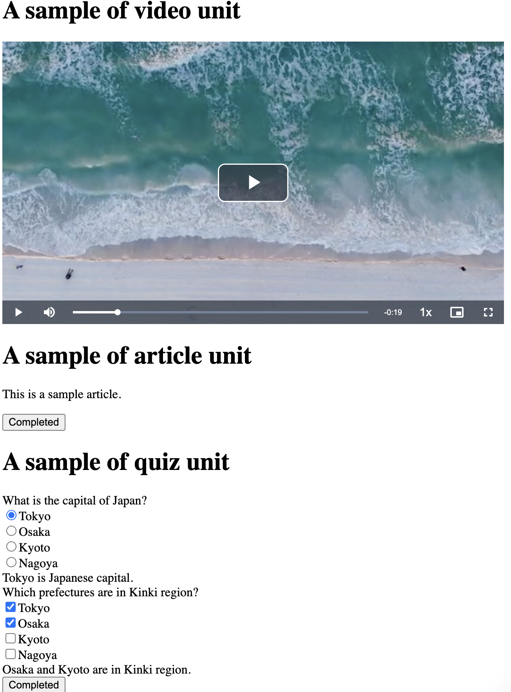

# Headless LMS

## Overview



## Architecture

under construction

### Sample Movie

<https://pixabay.com/ja/service/terms/>

### Mp4 to HLS

```bash
ffmpeg -i video.mp4 -c:v copy -c:a copy -f hls -hls_time 9 -hls_playlist_type vod -hls_segment_filename "video%3d.ts" video.m3u8
```

## DyanmoDB

```partiql
INSERT into "HLLMS_User" value {  
    'id': 'sample-user',
    'data': '{"name": "John", "age": 30}'
}

INSERT into "HLLMS_Module" value {  
    'id': 'sample-module',
    'units': '["sample-video", "sample-article", "sample-quiz"]',
}

INSERT into "HLLMS_Unit" value {  
    'id': 'sample-video',
    'type': 'video',
    'data': '{"contents": "https://d2st3kmma5alup.cloudfront.net/converted/video.m3u8"}'
}

INSERT into "HLLMS_Unit" value {
    'id': 'sample-article',
    'type': 'article',
    'data': '{"contents": "<p>This is a sample article.</p>", "button": {"completed": "Completed", "incompleted": "DONE"}}'
}

INSERT into "HLLMS_Unit" value {
    'id': 'sample-quiz',
    'type': 'quiz',
    'data': '{"contents": [{"id": "japanese-capital", "question": "What is the capital of Japan?", "type": "single", "choices": ["Tokyo", "Osaka", "Kyoto", "Nagoya"], "answer": ["Tokyo"], "answerDescription": "Tokyo is Japanese capital."}, {"id": "japanese-region", "question": "Which prefectures are in Kinki region?", "type": "multiple", "choices": ["Tokyo", "Osaka", "Kyoto", "Nagoya"], "answer": ["Osaka", "Kyoto"], "answerDescription": "Osaka and Kyoto are in Kinki region."}], "button": {"completed": "Completed", "incompleted": "DONE"}}'
}
```
